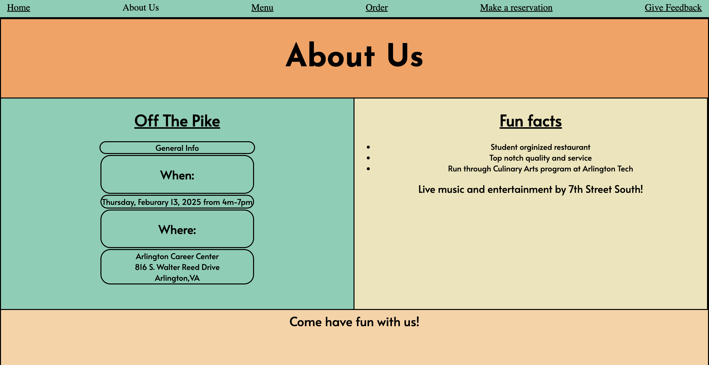
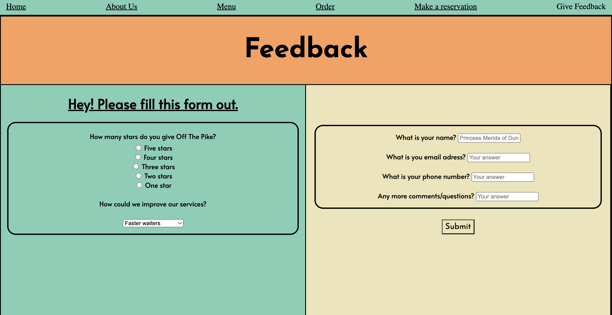

# My Culinary Website

I worked on - [this](../../../culinary-website/index.html) website. We worked on making the Off The Pike program/restaurant at out school have their own website. We gave it 6 pages. This is the link to the -[repo](https://github.com/Penrosian/culinary-website) we all worked on. We didn't have major problems or any problems with sharing code or pulling and mrging. We did have to merge at least 5 times but it was very straight forward. The hardest part of working in a shared repo was making my own branch and then adding it back togethor. I made my branch and pushed it before I had created an issue and that confused me and messed me up. I went back and created an issue and a pull request and it all worked out I think. I wasn't sure if I had to git pull before I even started my git add or righ beofore git push. I ended up just doing both most of the time and I didn't forget so yay for me.

## Picture of my 2 pages

The form that I wrote questioned the user on their experience with Off The Pike. It uses a lot of different form types including radio buttons and text boxes. The method type is POST and I used like 7 different input types in my form.
